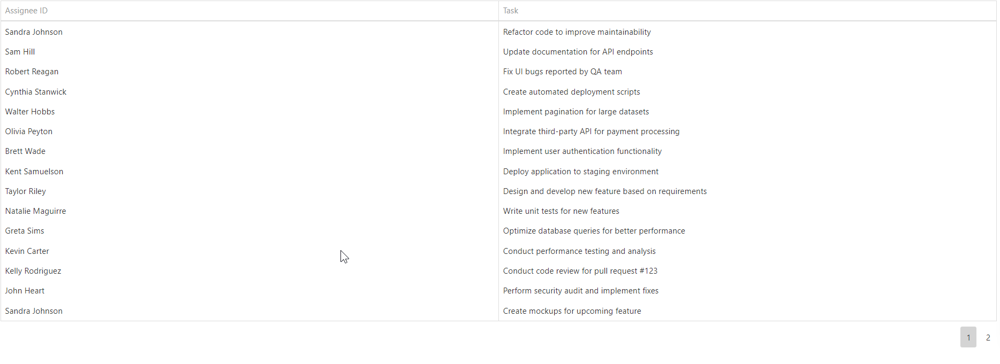

<!-- default badges list -->

<!-- default badges end -->
# DataGrid for DevExtreme - How to keep Edit Mode active when a user interacts with an advanced editor control

DevExpress DataGrid allows you to use advanced components as cell editors. For example, you can select a cell value from a list displayed within another DataGrid.

Embedded controls can display overlays, such as column choosers or filter dialogs. These pop-up dialogs insert their code into the root of the DOM tree, not inside the DOM of their parent components. When a user clicks on such an overlay element, the DataGrid assumes that the interaction occurred outside the component. As a result, it cancels Edit Mode. This behavior disrupts the intended user experience using an advanced control as an embedded editor.

You can keep Edit Mode active even if a user interacts with an embedded control’s overlay. [Monitor the DOM](https://developer.mozilla.org/en-US/docs/Web/API/MutationObserver) for new elements. If an overlay appears, mark it with the following CSS class: `dx-dropdowneditor-overlay`. The DataGrid then treats this element as part of the component UI and keeps Edit Mode active.

## Files to Review

- **jQuery**
    - [index.js](jQuery/src/index.js)
- **Angular**
    - [app.component.html](Angular/src/app/app.component.html)
    - [app.component.ts](Angular/src/app/app.component.ts)
- **Vue**
    - [Home.vue](Vue/src/components/HomeContent.vue)
    - [DropDownBoxComponent.vue](Vue/src/components/DropDownBoxComponent.vue)
- **React**
    - [App.tsx](React/src/App.tsx)
    - [DropDownBoxComponent.tsx](React/src/DropDownBoxComponent.tsx)
- **NetCore**    
    - [Index.cshtml](ASP.NET%20Core/Views/Home/Index.cshtml)

## Documentation

- [DataGrid: How to Customize Editors](https://js.devexpress.com/jQuery/Documentation/Guide/UI_Components/DataGrid/Editing/#Customize_Editors)

## More Examples

- [DataGrid Demo: Custom Editors](https://js.devexpress.com/jQuery/Demos/WidgetsGallery/Demo/DataGrid/CustomEditors/MaterialBlueLight/)
